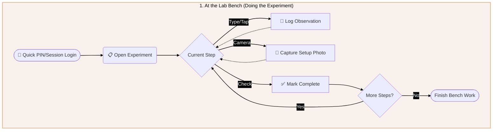
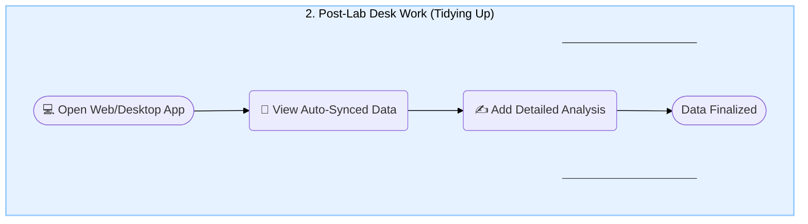
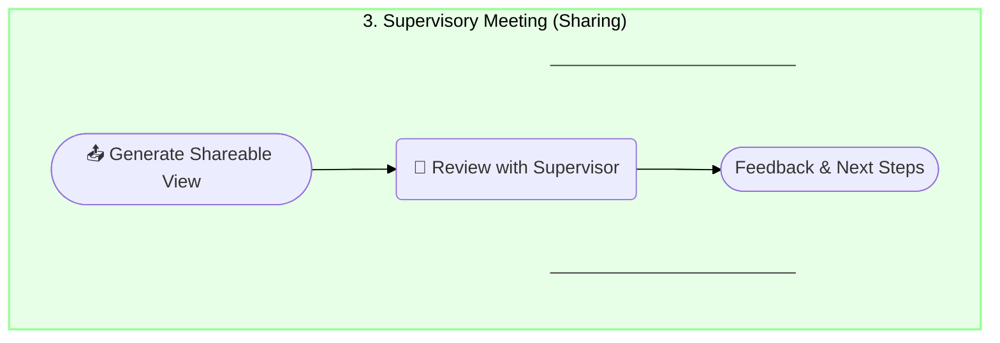
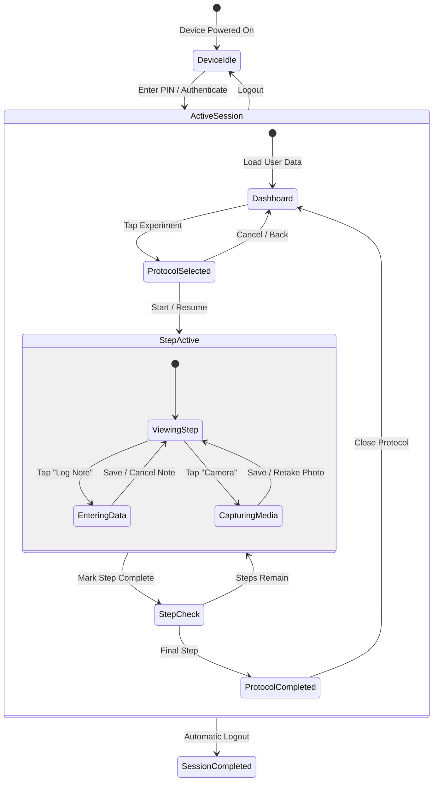

# Flowchart

## 1

## 2

## 3.

# State diageeam

# Storyboard

Here are the updated three storyboards:

---

**Storyboard 1: The Agony**

_Scene 1_ — Tom arrives at the lab at 6:40 AM. Benches are packed, equipment crowding every surface. He pulls out his paper notebook and uncaps his pen.

_Scene 2_ — Mid-experiment, a timer goes off. Tom is switching between two setups. A teammate calls out an observation. He scribbles frantically in the margin, the notes already messy and hard to follow.

_Scene 3_ — Another timer. Tom is now balancing his notebook awkwardly against the bench, trying to jot something down mid-step. A few details slip by unrecorded. He tells himself he'll remember them later.

_Scene 4_ — End of the day. Tom sits on campus, laptop open, notebook beside him. He stares at a page of chaotic scrawls and half-finished diagrams, trying to reconstruct what happened and in what order. He can't.

_Scene 5_ — It's Tuesday. Tom checks his phone — football starts soon. He's still typing, transferring notes. His backpack is stuffed with multiple notebooks and a laptop. His friends are already at the pitch waiting.

_Scene 6_ — Tom finally closes his laptop and heads out, late again. On the walk over, he wonders if there's a better way. He knows his method is barely holding together, and his PhD has only just begun.

---

**Storyboard 2: The Solution — Taking Notes**

_Scene 1_ — Tom is at the bench, mid-experiment. Instead of reaching for his notebook, he taps a few quick inputs on a nearby tablet. Minimal disruption. The entry is timestamped automatically.

_Scene 2_ — A teammate flags an unexpected observation. Tom taps to add a note and tags his colleague. The shared log updates for both of them instantly. No scribbled margins, no missed details.

_Scene 3_ — An alarm goes off mid-run. Tom pauses the current experiment on the tablet, switches to his second setup, and the screen shows exactly where he left off. He resumes without missing a beat.

_Scene 4_ — Tom photographs a result directly through the tablet. The image links automatically to the relevant step in his log. No loose phone photos, no disconnected files.

_Scene 5_ — End of day. Tom closes the tablet. There is nothing to retype. His record is already clean, ordered, and searchable. He picks up his bag — just his bag — and heads to the gym.

_Scene 6_ — It's Tuesday. Tom zips up his bag with only his tablet inside. He's out the door on time. His friends see him walk onto the pitch without a stack of notebooks in tow.

---

**Storyboard 3: Meeting the Supervisor**

_Scene 1_ — Wednesday evening. Instead of spending hours reformatting notes, Tom opens the app and taps export. A clean, readable summary generates in seconds. He emails it to Professor Fowler and closes his laptop.

_Scene 2_ — Thursday morning. Tom walks into the bi-weekly meeting relaxed. He's not anxious about whether his notes will make sense to someone else.

_Scene 3_ — Professor Fowler opens the shared document on his screen. The entries are clear, timestamped, and organised by experiment. He scrolls through without squinting. This is a far cry from the chaotic notebook that once left him astonished.

_Scene 4_ — Professor Fowler asks a specific question about a result from two weeks ago. Tom searches for it in seconds and pulls it up on the spot.

_Scene 5_ — They spend the rest of the meeting actually discussing the science, not deciphering handwriting or reconstructing timelines. Professor Fowler is visibly more engaged.

_Scene 6_ — The meeting wraps up early. Tom heads out with a clear list of next steps. No confusion, no follow-up emails to clarify what a note meant. Just progress.