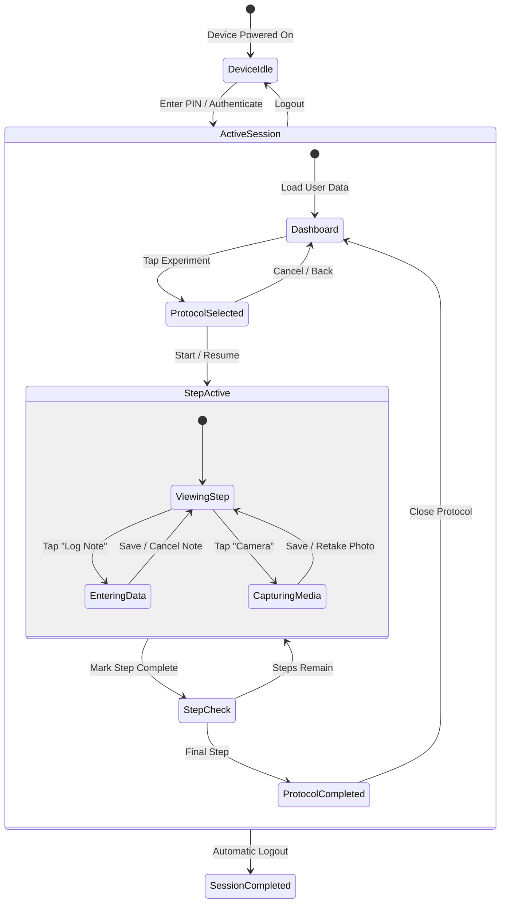

# State diageeam

```mermaid
stateDiagram-v2

[*] --> DeviceIdle: Device Powered On

  

DeviceIdle --> ActiveSession: Enter PIN / Authenticate

state ActiveSession {

[*] --> Dashboard: Load User Data

Dashboard --> ProtocolSelected: Tap Experiment

ProtocolSelected --> Dashboard: Cancel / Back

ProtocolSelected --> StepActive: Start / Resume

state StepActive {

[*] --> ViewingStep

ViewingStep --> EnteringData: Tap "Log Note"

EnteringData --> ViewingStep: Save / Cancel Note

ViewingStep --> CapturingMedia: Tap "Camera"

CapturingMedia --> ViewingStep: Save / Retake Photo

}

StepActive --> StepCheck: Mark Step Complete

StepCheck --> StepActive: Steps Remain

StepCheck --> ProtocolCompleted: Final Step

ProtocolCompleted --> Dashboard: Close Protocol

}

ActiveSession --> SessionCompleted: Automatic Logout

%% Interruption and Security States

ActiveSession --> DeviceIdle: Logout
```

