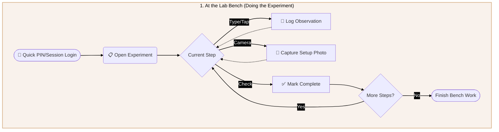

```mermaid
flowchart LR
    subgraph Stage1 ["<span style='white-space: nowrap; color: black;'>1. At the Lab Bench (Doing the Experiment)</span>"]
        direction LR
        Login([👤 Quick PIN/Session Login]) --> Experiment(📋 Open Experiment)
        Experiment --> Step{Current Step}
        Step -->|Type/Tap| Note[📝 Log Observation]
        Step -->|Camera| Photo[📸 Capture Setup Photo]
        Step -->|Check| Done[✅ Mark Complete]
        
        Note -.-> Step
        Photo -.-> Step
        Done --> Next{More Steps?}
        Next -->|Yes| Step
        Next -->|No| EndStage1([Finish Bench Work])
    end
    
    style Stage1 fill:#f9f2ec,stroke:#d9b38c,stroke-width:2px,color:#000000
    linkStyle default stroke:#000000,stroke-width:1.5px,color:#ffffff
    classDef edgeLabel color:#ffffff,background-color:#000000
```
