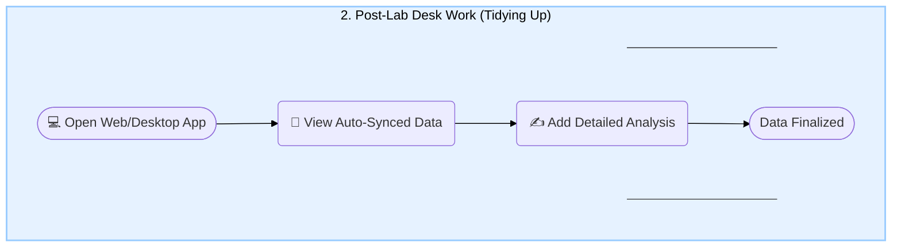

```mermaid
flowchart LR
    subgraph Stage2 ["<span style='color:black'>2. Post-Lab Desk Work (Tidying Up)</span><br><br>"]
        direction LR
        TL[ ] --- TR[ ]
        Desk([💻 Open Web/Desktop App]) --> Sync(🔄 View Auto-Synced Data)
        Sync --> Detail(✍️ Add Detailed Analysis)
        Detail --> EndStage2([Data Finalized])
        BL[ ] --- BR[ ]
    end
    style Stage2 fill:#e6f2ff,stroke:#99ccff,stroke-width:2px,color:#000000
    style TL fill:none,stroke:none
    style TR fill:none,stroke:none
    style BL fill:none,stroke:none
    style BR fill:none,stroke:none
    linkStyle 1 stroke:#000000,color:#000000
    linkStyle 2 stroke:#000000,color:#000000
    linkStyle 3 stroke:#000000,color:#000000
```

