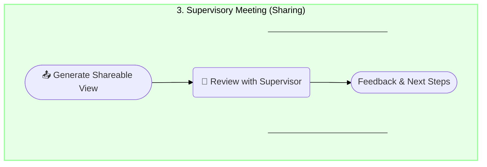

```mermaid
flowchart LR

subgraph Stage3 ["<span style='color:black'>3. Supervisory Meeting (Sharing)</span><br><br>"]

direction LR

TL[ ] --- TR[ ]

Share([📤 Generate Shareable View]) --> Meet(🤝 Review with Supervisor)

Meet --> EndStage3([Feedback & Next Steps])

BL[ ] --- BR[ ]

end

style Stage3 fill:#e6ffe6,stroke:#99ff99,stroke-width:2px,color:#000000

style TL fill:none,stroke:none

style TR fill:none,stroke:none

style BL fill:none,stroke:none

style BR fill:none,stroke:none

linkStyle 1 stroke:#000000,color:#000000

linkStyle 2 stroke:#000000,color:#000000
```

